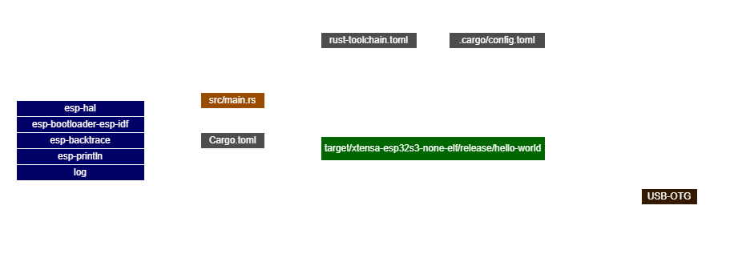

# Hello World

This program prints **Hello, World!** to the serial monitor every 500 ms.
It shows the basic structure of a `no_std` Rust application on an Espressif chip. 

## Crates

- `esp-hal` -> Initializes the board and provides delay
- `esp-bootloader-esp-idf` -> Ready-to-use Espressif 2nd stage bootloader
- `esp-backtrace` ->  Handles panic (debug)
- `log` + `esp-println` -> Print messages to the serial monitor 

## Code

```rust
#![no_std]
#![no_main]

use esp_backtrace as _;
use esp_hal::{Config, delay::Delay};
use log::info;

esp_bootloader_esp_idf::esp_app_desc!();

#[esp_hal::main]
fn main() -> ! {
    // Initialize logger
    esp_println::logger::init_logger_from_env();

    // Initialize hardware
    let _peripherals = esp_hal::init(Config::default());

    // Create delay
    let delay = Delay::new();

    // Main loop
    loop {
        info!("Hello, World!");
        delay.delay_millis(500);
    }
}
```

## Monitor output

```bash
ESP-ROM:esp32s3-20210327
Build:Mar 27 2021
rst:0x15 (USB_UART_CHIP_RESET),boot:0xa (SPI_FAST_FLASH_BOOT)
Saved PC:0x40378eb1
SPIWP:0xee
Octal Flash Mode Enabled
For OPI Flash, Use Default Flash Boot Mode
mode:SLOW_RD, clock div:2
load:0x3fce2820,len:0x158c
load:0x403c8700,len:0xd24
load:0x403cb700,len:0x2f34
entry 0x403c8924
I (43) boot: ESP-IDF v5.5.1-838-gd66ebb86d2e 2nd stage bootloader
I (43) boot: compile time Nov 26 2025 12:27:56
I (43) boot: Multicore bootloader
I (45) boot: chip revision: v0.1
I (47) boot: efuse block revision: v1.2
I (51) boot.esp32s3: Boot SPI Speed : 40MHz
I (55) boot.esp32s3: SPI Mode       : SLOW READ
I (59) boot.esp32s3: SPI Flash Size : 32MB
I (63) boot: Enabling RNG early entropy source...
I (67) boot: Partition Table:
I (70) boot: ## Label            Usage          Type ST Offset   Length
I (76) boot:  0 nvs              WiFi data        01 02 00009000 00006000
I (83) boot:  1 phy_init         RF data          01 01 0000f000 00001000
I (89) boot:  2 factory          factory app      00 00 00010000 00fa0000
I (96) boot: End of partition table
I (99) esp_image: segment 0: paddr=00010020 vaddr=3c000020 size=01ab4h (  6836) map
I (109) esp_image: segment 1: paddr=00011adc vaddr=3fc89790 size=00708h (  1800) load
I (115) esp_image: segment 2: paddr=000121ec vaddr=40378000 size=01790h (  6032) load
I (124) esp_image: segment 3: paddr=00013984 vaddr=00000000 size=0c694h ( 50836)
I (147) esp_image: segment 4: paddr=00020020 vaddr=42010020 size=03cb0h ( 15536) map
I (154) boot: Loaded app from partition at offset 0x10000
I (154) boot: Disabling RNG early entropy source...
INFO - Hello, World!
INFO - Hello, World!
INFO - Hello, World!
INFO - Hello, World!
```

## Diagram 

